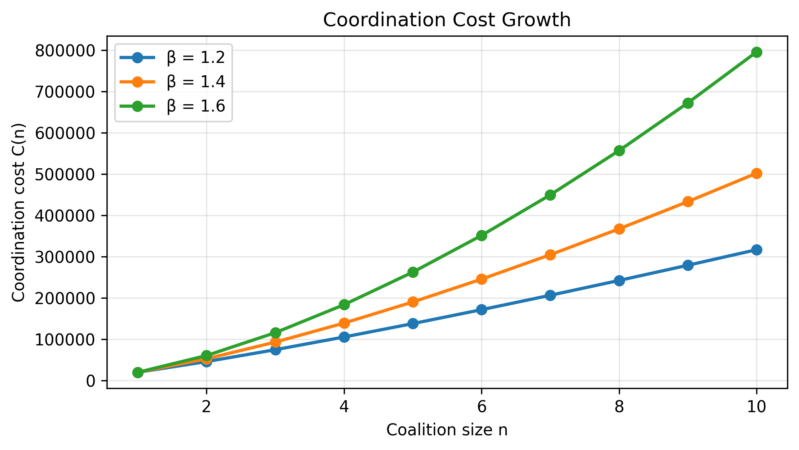
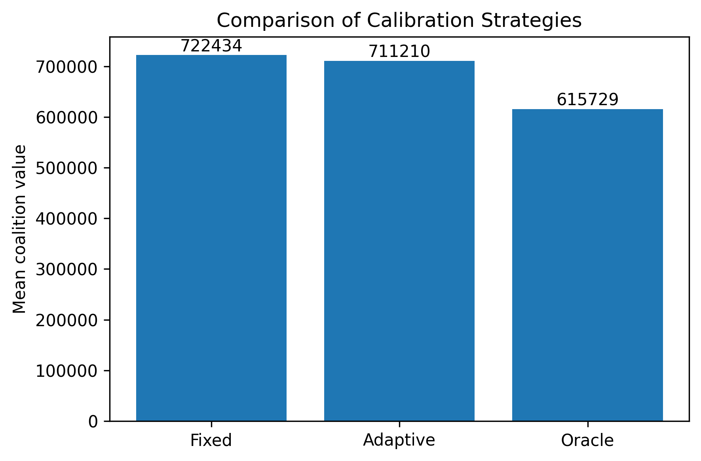

# Team Formation Pipeline

Research prototype for **project-team formation from digital traces** using constrained coalition search and cooperative-game-inspired allocation logic.

> **Portfolio / research version.** This public repository contains synthetic demo data only. It is intended to demonstrate the modelling and engineering workflow, not to make real HR decisions.

## What the project does

The pipeline turns Jira-like task records into employee-level scores, searches for feasible project teams under budget and size constraints, evaluates coalition value, and produces representative team configurations and budget-allocation results.

Main stages:

1. Jira-like data aggregation and feature preparation.
2. Employee `S_score` estimation.
3. Synthetic compensation modelling for the public demo.
4. Heuristic coalition search under budget constraints.
5. Coalition valuation with coordination-cost penalties.
6. Shapley-inspired marginal-contribution allocation.
7. Monte Carlo comparison of fixed, adaptive, and oracle-like calibration strategies.
8. Export of CSV / JSON results and publication-ready figures.

## Tech stack

- Python
- pandas / NumPy
- SciPy
- Matplotlib
- Jupyter Notebook

## Repository structure

```text
team-formation-pipeline/
├── README.md
├── README_RU.md
├── config.demo.json
├── requirements.txt
├── src/
│   └── team_formation_pipeline.py
├── scripts/
│   └── run_demo.py
├── data/
│   └── demo/
│       └── jira_issues.csv
├── notebooks/
│   └── research_prototype.ipynb
├── docs/
│   ├── METHODOLOGY.md
│   └── GITHUB_UPLOAD.md
└── assets/
```

## Quick start

### 1. Create a virtual environment

```bash
python -m venv .venv
```

Windows:

```bash
.venv\Scripts\activate
```

macOS / Linux:

```bash
source .venv/bin/activate
```

### 2. Install dependencies

```bash
pip install -r requirements.txt
```

### 3. Run the synthetic demo

```bash
python scripts/run_demo.py --clean
```

Generated files will appear in `outputs/demo/`.

## Example outputs

After a demo run the pipeline produces:

- `all_employees_processed.csv`
- `comprehensive_coalition_analysis.csv`
- `shapley_*_results.json`
- `MonteCarloResults.txt`
- `Figure1_CoordinationCost.png`
- `Figure2_PerformanceComparison.png`
- `run_metadata.json`
- `pipeline.log`

The public demo intentionally does **not** include real employee records or original Jira exports.

### Demo figures

Coordination-cost sensitivity:



Calibration-strategy comparison:



## Research status and limitations

This is an academic prototype. The current implementation uses a heuristic coalition search and a Shapley-inspired allocation approximation rather than an exact exhaustive Shapley-value calculation for large candidate sets. Some employee-level features and all compensation variables in the public demo are synthetic modelling inputs.

See [`docs/METHODOLOGY.md`](docs/METHODOLOGY.md) for details and limitations.

## Background

The project was developed as part of postgraduate research on mathematical methods for project-team formation, labour-resource allocation, and cooperative game-theoretic modelling.

## Data privacy

Only synthetic demo data are committed to this repository. Real organizational datasets, employee identifiers, Jira exports, credentials, and private experimental outputs must remain outside version control.

## License

No open-source license is granted by default. The code is published as a portfolio / academic research artifact unless a separate license is added later.
